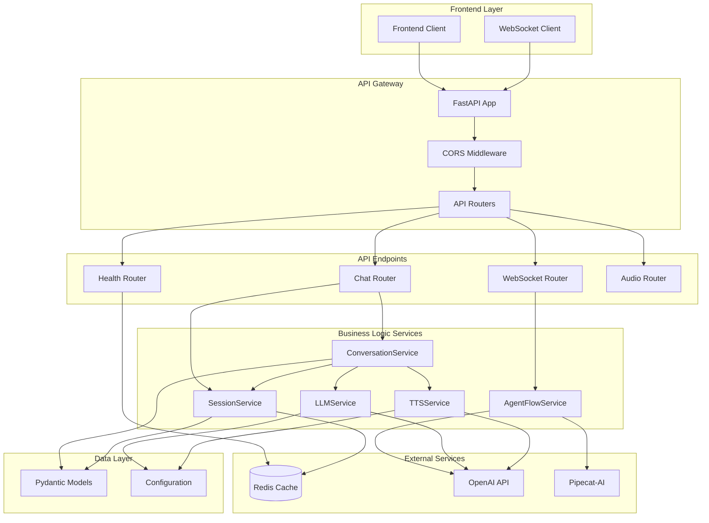

# Back-to-Back AI Chat Backend Implementation

## Overview

The **Back-to-Back AI Chat** backend is a Python-based FastAPI application that orchestrates AI-to-AI conversations with text-to-speech capabilities. It provides both RESTful API endpoints and real-time WebSocket connections for interactive AI agent conversations.

## Architecture Diagram



## Technology Stack

| Component | Technology | Purpose |
|-----------|------------|---------|
| **Web Framework** | FastAPI | High-performance async API framework |
| **Server** | Uvicorn | ASGI server for FastAPI |
| **Cache/Sessions** | Redis | Session storage with TTL |
| **AI Models** | OpenAI GPT-4o-mini | Text generation for conversations |
| **Text-to-Speech** | OpenAI TTS | Audio synthesis with multiple voices |
| **Real-time** | WebSockets | Live conversation streaming |
| **Advanced AI** | Pipecat-AI | Conversation flow orchestration |
| **Data Validation** | Pydantic | Type-safe data models |
| **Testing** | Pytest | Unit and integration testing |

## Project Structure

```
src/back_to_back/
├── main.py              # Entry point and CLI interface
├── app.py               # FastAPI application setup
├── server.py            # Development server script
├── config.py            # Environment configuration
├── models.py            # Pydantic data models
├── dependencies.py      # FastAPI dependency injection
├── routers/             # API endpoint routers
│   ├── health.py        # Health check endpoints
│   ├── chat.py          # RESTful chat API
│   ├── websocket.py     # WebSocket endpoints
│   └── audio.py         # Audio file serving
└── services/            # Business logic services
    ├── session.py       # Redis session management
    ├── conversation.py  # Conversation orchestration
    ├── llm.py           # OpenAI LLM integration
    ├── tts.py           # Text-to-speech synthesis
    └── agent_flow.py    # Pipecat-AI flow management
```

## Core Components

### 1. FastAPI Application (`app.py`)

The main application setup with:
- **CORS middleware** for cross-origin requests
- **Redis integration** with connection pooling
- **Router registration** for modular endpoints
- **Lifespan management** for startup/shutdown

```python
app = FastAPI(
    title="Back to Back AI Chat",
    description="AI agent conversation system with TTS",
    version="0.1.0",
    lifespan=lifespan,
)
```

### 2. Data Models (`models.py`)

Type-safe Pydantic models for:

#### Core Enums
- **`SpeakerType`**: AGENT_1, AGENT_2, HUMAN
- **`ConversationMode`**: AI_VS_AI, HUMAN_VS_AI  
- **`ConversationPhase`**: INTRODUCTION, CONVERSATION, FLIRT, ROAST

#### Request/Response Models
- **`InitRequest/InitResponse`**: Session initialization
- **`ChatRequest/ChatResponse`**: Turn-based conversation
- **`ChatMessage`**: Individual messages with audio URLs
- **`SessionState`**: Complete conversation state

### 3. API Routers

#### Health Router (`routers/health.py`)
- `GET /api/v1/health` - Basic service health check
- `GET /api/v1/health/redis` - Redis connectivity check

#### Chat Router (`routers/chat.py`)
- `POST /api/v1/init` - Initialize new conversation session
- `POST /api/v1/chat` - Process conversation turns
- `GET /api/v1/session/{id}` - Retrieve session info and history
- `DELETE /api/v1/session/{id}` - Clean up session

#### WebSocket Router (`routers/websocket.py`)
- `WS /ws` - Real-time agent-to-agent conversations
- Query parameters: `agent_1_persona`, `agent_2_persona`, `scenario`, `max_turns`

#### Audio Router (`routers/audio.py`)
- `GET /audio/{filename}` - Serve generated TTS audio files

### 4. Business Logic Services

#### SessionService (`services/session.py`)
- **Redis-based session storage** with automatic TTL (24 hours)
- **Session CRUD operations** with JSON serialization
- **TTL extension** for active sessions

```python
class SessionService:
    async def save_session(self, session_state: SessionState)
    async def get_session(self, session_id: str) -> Optional[SessionState]
    async def delete_session(self, session_id: str) -> bool
```

#### ConversationService (`services/conversation.py`)
- **Turn-based conversation management**
- **Speaker determination logic** (alternating for AI vs AI)
- **Conversation phase transitions** based on turn ratio:
  - 0-30%: Introduction
  - 30-70%: Conversation
  - 70-85%: Flirt
  - 85-100%: Roast

#### LLMService (`services/llm.py`)
- **OpenAI GPT-4o-mini integration**
- **Phase-aware prompt engineering** with persona-based system prompts
- **Conversation context management** (last 10 messages)
- **Error handling** with graceful fallbacks

#### TTSService (`services/tts.py`)
- **OpenAI TTS integration** with voice selection:
  - Agent 1: "alloy" voice
  - Agent 2: "nova" voice
- **Audio file generation and serving**
- **Automatic cleanup** of old audio files

#### AgentFlowService (`services/agent_flow.py`)
- **Pipecat-AI integration** for advanced conversation flows
- **Real-time WebSocket streaming**
- **Conversation orchestration** with multiple agents
- **Phase transition management**

## Configuration

Environment-based configuration via `config.py`:

```python
class Settings:
    # API Keys
    OPENAI_API_KEY: Optional[str]
    ELEVENLABS_API_KEY: Optional[str]
    
    # Redis Configuration
    REDIS_URL: str = "redis://localhost:6379"
    SESSION_TTL: int = 86400  # 24 hours
    
    # LLM Configuration
    LLM_MODEL: str = "gpt-4o-mini"
    LLM_MAX_TOKENS: int = 200
    LLM_TEMPERATURE: float = 0.8
    
    # TTS Configuration
    TTS_MODEL: str = "tts-1"
    AUDIO_TTL: int = 7200  # 2 hours
    
    # Server Configuration
    HOST: str = "0.0.0.0"
    PORT: int = 8000
    CORS_ORIGINS: list[str] = ["*"]
```

## API Usage Examples

### Initialize a Conversation

```http
POST /api/v1/init
Content-Type: application/json

{
  "agent_1_persona": "You are a friendly robot who loves technology and innovation.",
  "agent_2_persona": "You are a skeptical human who questions everything.",
  "mode": "ai_vs_ai",
  "scenario": "A debate about the future of AI",
  "max_turns": 20
}
```

Response:
```json
{
  "session_id": "123e4567-e89b-12d3-a456-426614174000",
  "config": {
    "mode": "ai_vs_ai",
    "max_turns": "20",
    "agent_1_persona": "You are a friendly robot who loves technology...",
    "agent_2_persona": "You are a skeptical human who questions..."
  },
  "status": "initialized"
}
```

### Process a Conversation Turn

```http
POST /api/v1/chat
Content-Type: application/json

{
  "session_id": "123e4567-e89b-12d3-a456-426614174000"
}
```

Response:
```json
{
  "message": {
    "speaker": "agent_1",
    "text": "Hello! I'm excited to discuss the future of AI with you.",
    "audio_url": "/audio/msg_123_agent1.mp3",
    "turn_number": 1,
    "timestamp": "2024-01-15T10:30:00Z"
  },
  "next_speaker": "agent_2",
  "conversation_phase": "introduction",
  "turn_count": 1,
  "is_conversation_complete": false
}
```

### WebSocket Real-time Connection

```javascript
const ws = new WebSocket('ws://localhost:8000/ws?agent_1_persona=friendly%20robot&agent_2_persona=skeptical%20human&scenario=flirt&max_turns=10');

ws.onmessage = function(event) {
    console.log('Agent message:', event.data);
};
```

## Conversation Flow Logic

### Phase Transitions
The conversation automatically transitions through phases based on turn progress:

1. **Introduction Phase (0-30% of turns)**
   - Agents introduce themselves
   - Light, friendly conversation
   - Getting to know each other

2. **Conversation Phase (30-70% of turns)**
   - Main dialogue based on personas
   - Deeper topics and opinions
   - Authentic character interaction

3. **Flirt Phase (70-85% of turns)**
   - Playful and charming responses
   - Romantic undertones and compliments
   - Humorous and engaging banter

4. **Roast Phase (85-100% of turns)**
   - Witty and sarcastic exchanges
   - Playful insults and clever jabs
   - Fun competitive banter

### Speaker Management
- **AI vs AI Mode**: Speakers alternate (Agent 1 → Agent 2 → Agent 1...)
- **Human vs AI Mode**: Human and AI alternate turns
- **Force Agent**: Optional parameter to override turn order

## Error Handling

The system includes comprehensive error handling:

- **Session Management**: 404 for missing sessions, 400 for invalid requests
- **API Rate Limits**: Graceful handling of OpenAI API limits
- **Redis Connectivity**: Health checks and connection retry logic
- **Audio Generation**: Fallback responses for TTS failures
- **WebSocket**: Proper cleanup and error messaging

## Testing

Comprehensive test suite (`tests/test_api.py`) with:
- **Mocked Redis** for isolated testing
- **Session lifecycle tests** (create, read, delete)
- **API endpoint validation** 
- **Error condition testing**
- **Mock external services** (OpenAI, Redis)

Run tests with:
```bash
pytest tests/ --cov=back_to_back
```

## Development Setup

1. **Install dependencies**:
   ```bash
   pip install -e .
   ```

2. **Set environment variables**:
   ```bash
   export OPENAI_API_KEY="your-api-key"
   export REDIS_URL="redis://localhost:6379"
   ```

3. **Start Redis**:
   ```bash
   redis-server
   ```

4. **Run the server**:
   ```bash
   back-to-back --reload
   ```

5. **Access API documentation**:
   - Swagger UI: `http://localhost:8000/docs`
   - ReDoc: `http://localhost:8000/redoc`

## Production Considerations

- **Environment Configuration**: Use proper environment variables for API keys
- **Redis Persistence**: Configure Redis with appropriate persistence settings
- **CORS Settings**: Restrict origins for production deployment
- **Rate Limiting**: Implement rate limiting for API endpoints
- **Audio Storage**: Consider cloud storage for audio files in production
- **Monitoring**: Add logging and metrics for conversation analytics
- **Scaling**: Use Redis Cluster and multiple FastAPI instances for scale

## Future Enhancements

- **Multi-language support** for conversations
- **Custom voice cloning** with ElevenLabs integration
- **Conversation analytics** and insights
- **Advanced pipecat-flows** with complex conversation trees
- **Real-time visualization** of conversation state
- **Webhook integration** for external systems
- **Conversation export** functionality (JSON, transcript)
