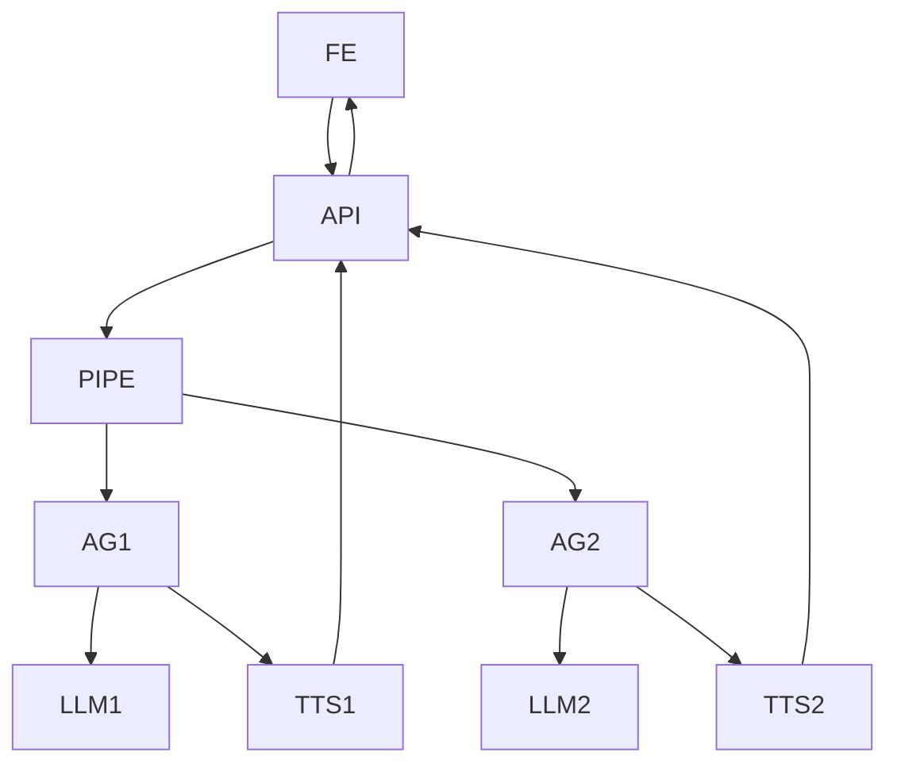

### Pipecat-Flows Agent-to-Agent Backend Documentation

Below is updated backend documentation to account for using **pipecat-flows** for an agent-to-agent (AI vs AI) chat app—streamlining real-time, multimodal (voice/text) interactions and orchestration.

## Architecture Overview

**Pipecat-Flows** enables declarative, structured conversational flows and automates session, state, and model management. The main FastAPI server acts as an API/WebSocket gateway; all agent conversation and transitions are handled by Pipecat pipelines.

- **FastAPI backend** acts as the edge API server.
- **Pipecat Flows engine** defines and runs agent-vs-agent conversation logic, with explicit nodes for roles, turn switches, and conversation phases (e.g., flirt → roast).
- **Audio/text** is streamed via WebSocket.
- **Frontend** presents streamed audio/dialog and handles user settings.

## Recommended Python Tech Stack

| Layer               | Tech/Library                                      |
|---------------------|---------------------------------------------------|
| Web API             | FastAPI                                           |
| Socket Transport    | Pipecat’s FastAPIWebsocketTransport               |
| Conversation Logic  | pipecat-flows (pip install pipecat-ai-flows)      |
| AI Models           | OpenAI, Google (or local models via Pipecat)      |
| TTS                 | Pipecat's built-in TTS modules or service plugins |
| State               | In-process (for ephemeral) or Redis/Postgres      |
| Orchestration       | Pipecat FlowManager                               |
| Frontend            | (Your choice—React, Vue, etc.)                    |
| Animations/Avatars  | Custom (your UI stack; sync to Pipecat events)    |

## API and Data Flow

*All agent turns, phase switches, and voice rendering are managed inside the Pipecat pipeline. The backend only exposes API/WebSocket endpoints and session management.*

- **Frontend connects to FastAPI backend** (usually via `/ws` for audio/text stream).
- **Session is created/managed**; conversation flow launches according to uploaded or hardcoded Pipecat flow config (with roles and phases for Agent A and Agent B).
- **Each agent turn triggers:**
  - LLM processing (one agent speaks per node/turn)
  - TTS synthesis on agent output (handled in the flow)
  - Audio streamed to frontend; frontend can overlay custom animation events
- **Phase transitions** (e.g., flirt → roast) are defined within the flow (by node transitions, triggers, or counter).

### Example Mermaid Diagram

This shows the system architecture and core data flow with Pipecat-Flows orchestrating both agents from a single backend process:

Github plot



Non-github plot
```mermaid
flowchart TD
    subgraph FE [Frontend (Web UI)]
        A1[Connect to WebSocket /ws]
        A2[Show chat & play audio]
    end
    subgraph API [FastAPI Backend]
        B1[WebSocket Handler]
        B2[Pipecat Websocket Transport]
    end
    subgraph PIPE [Pipecat-Flows Pipeline]
        C1[Agent A Node]
        C2[Phase Logic (Flirt/Roast)]
        C3[Agent B Node]
        C4[TTS & LLM Modules]
    end

    A1 -- "Audio/text stream" --> B1
    B1 --> B2
    B2 -- "Session bound" --> PIPE
    C1 -- "LLM call" --> C4
    C3 -- "LLM call" --> C4
    C1 --> C2
    C3 --> C2
    C2 -- "Switch turn/phase" --> C1
    C2 -- "Switch turn/phase" --> C3
    C4 -- "Synthesized audio" --> B2
    B2 -- "Stream output" --> B1
    B1 -- "Text/audio event" --> A2
```

## How the Stack Fits Together

- **FastAPI**: Runs your main API server and websocket endpoints.
- **Pipecat-Flows**: Defines the entire conversational process as a flow—explicitly setting up turn-taking between agents, phases, and message logic. Handles all LLM and TTS calls in the pipeline.
- **WebSocket**: Used for real-time streaming of agent speech/audio, text, and events to the frontend; also allows the frontend to catch events for animation triggers.
- **Frontend**: Binds with the websocket, displays the conversation, plays generated audio, and triggers your custom avatar/animation logic for each agent’s turn.
- **State/persistence**: (Optional but recommended for multi-user) Use Redis, Postgres, or similar to manage session storage if needed.

## Pipecat-Flows Agent-to-Agent Flow Features

- Each agent’s persona, prompt logic, and turn/phase behavior defined in flow nodes.
- Flows can be edited/visualized using the [Pipecat Flows Editor][1] for optimal maintainability.
- TTS and LLM are plug-n-play: you can switch providers as required.
- All chat/TTS and agent switching is in a single process—no need for multiple FastAPI servers or duplicated orchestration logic.
- Your frontend can easily overlay **custom animations** in sync with audio/text/player events received through the websocket.

**This stack leverages Pipecat-Flows’ strengths for coordinated, multimodal AI-to-AI voice interaction, combining robust Python backend, structured dialog flows, and easy frontend customizability for maximum effect.**[2][1][3][4]

[1] https://github.com/pipecat-ai/pipecat-flows
[2] https://docs.pipecat.ai/guides/features/pipecat-flows
[3] https://docs.pipecat.ai
[4] https://github.com/pipecat-ai/pipecat
[5] https://aws.amazon.com/blogs/machine-learning/building-intelligent-ai-voice-agents-with-pipecat-and-amazon-bedrock-part-1/
[6] https://docs.pipecat.ai/getting-started/core-concepts
[7] https://github.com/aws-samples/build-intelligent-ai-voice-agents-with-pipecat-and-amazon-bedrock
[8] https://docs.mermaidchart.com/mermaid-oss/syntax/flowchart.html
[9] https://www.youtube.com/watch?v=tAQW319_h-s
[10] https://www.linkedin.com/posts/kwkramer_open-source-graphical-voice-ai-agent-builder-activity-7284648942443679746-MGvL
[11] https://www.youtube.com/watch?v=WBd5pcyFeTQ
[12] https://docs.pipecat.ai/server/frameworks/flows/pipecat-flows
[13] https://www.youtube.com/watch?v=3MNiaR6G08s
[14] https://www.youtube.com/watch?v=XZ5p_24uDvo
[15] https://langfuse.com/integrations/frameworks/pipecat
[16] https://mermaid.js.org/syntax/examples
[17] https://docs.nvidia.com/ace/ace-controller-microservice/1.0/user-guide.html
[18] https://webrtc.ventures/2025/03/on-premise-voice-ai-creating-local-agents-with-llama-ollama-and-pipecat/
[19] https://www.reddit.com/r/ChatGPT/comments/1fj46hv/i_gave_chatgpt_some_code_and_asked_it_to_give_me/
[20] https://docs.mermaidchart.com/mermaid-oss/syntax/examples.html
